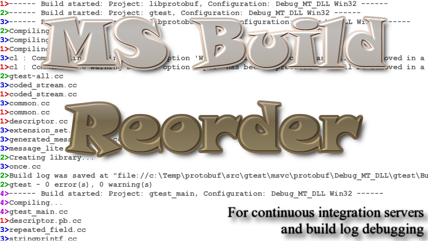

[](https://opensource.org/licenses/MIT)
[](https://github.com/end2endzone/msbuildreorder/releases)
[](https://ci.appveyor.com/project/end2endzone/msbuildreorder/branch/master)
[](https://ci.appveyor.com/project/end2endzone/msbuildreorder/branch/master/tests)

AppVeyor build statistics:

[](https://ci.appveyor.com/project/end2endzone/msbuildreorder/branch/master)


# msbuildreorder

MSBuildReorder is a tool for "reordering" (Build Order) a multi-process C++ build log. It allows a developer to convert the build log as if it was generated with a single processor.

Building a solution that has multiple projects can quickly become bloated with too many lines that are not related to each other. For this reason, finding the actual cause of a build fail is harder than it should be.  MSBuildReorder is able to read the log and reorder the projects in a sequential order.

It's main features are:

* Supports both msbuild and Visual Studio 2008 (and over) build logs.
* Useful for [Continuous Integration (CI)](http://en.wikipedia.org/wiki/Continuous_integration) servers (build servers).
* Allows quicker identification of the project that caused an error.
* Command line support.

The reordering functionality is already available from Visual Studio IDE (Output window, 'Build Order' option). However, this feature is not available when launching msbuild.exe or devenv.exe from the command line. This is where msbuildreorder becomes useful.

# Command Line Usage

```
msbuildreorder --input=<path> --output=<path>
msbuildreorder --help
msbuildreorder --version
```

| Argument             | Description                             |
|----------------------|-----------------------------------------|
| --help               | Display this help message.              |
| --version            | Display this application version.       |
| --input=\<path>      | Path of the input log file.             |
| --output=\<path>     | Path of the reordered output log file.  |


# Example

The following shows a multi-process build log compiling the [libprotobuf](http://code.google.com/p/protobuf/) library. MSBuildReorder can be used to reorder the multi-threaded log on a Continuous Integration (CI) server.

### Build Log (libprotobuf):
Output-Build.txt
```cpp
1>------ Build started: Project: libprotobuf, Configuration: Debug_MT_DLL Win32 ------
2>------ Build started: Project: gtest, Configuration: Debug_MT_DLL Win32 ------
3>------ Build started: Project: libprotobuf-lite, Configuration: Debug_MT_DLL Win32 ------
2>Compiling...
3>Compiling...
1>Compiling...
3>cl : Command line warning D9035 : option 'Wp64' has been deprecated and will be removed in a future release
1>cl : Command line warning D9035 : option 'Wp64' has been deprecated and will be removed in a future release
2>gtest-all.cc
3>coded_stream.cc
1>coded_stream.cc
3>common.cc
1>common.cc
1>descriptor.cc
3>extension_set.cc
3>generated_message_util.cc
3>message_lite.cc
2>Creating library...
3>once.cc
2>Build log was saved at "file://c:\Temp\protobuf\src\gtest\msvc\protobuf\Debug_MT_DLL\gtest\BuildLog.htm"
2>gtest - 0 error(s), 0 warning(s)
4>------ Build started: Project: gtest_main, Configuration: Debug_MT_DLL Win32 ------
4>Compiling...
4>gtest_main.cc
1>descriptor.pb.cc
3>repeated_field.cc
3>stringprintf.cc
4>Creating library...
4>Build log was saved at "file://c:\Temp\protobuf\src\gtest\msvc\protobuf\Debug_MT_DLL\gtest_main\BuildLog.htm"
4>gtest_main - 0 error(s), 0 warning(s)
1>descriptor_database.cc
3>wire_format_lite.cc
3>zero_copy_stream.cc
3>zero_copy_stream_impl_lite.cc
1>dynamic_message.cc
3>atomicops_internals_x86_msvc.cc
3>Generating Code...
1>extension_set.cc
3>Creating library...
3>Build log was saved at "file://c:\Temp\protobuf\src\vsprojects\protobuf\Debug_MT_DLL\libprotobuf-lite\BuildLog.htm"
3>libprotobuf-lite - 0 error(s), 1 warning(s)
1>extension_set_heavy.cc
1>generated_message_reflection.cc
1>generated_message_util.cc
1>gzip_stream.cc
1>importer.cc
1>message.cc
1>message_lite.cc
1>once.cc
1>parser.cc
1>printer.cc
1>reflection_ops.cc
1>repeated_field.cc
1>service.cc
1>Generating Code...
1>Compiling...
1>stringprintf.cc
1>structurally_valid.cc
1>strutil.cc
1>substitute.cc
1>text_format.cc
1>tokenizer.cc
1>unknown_field_set.cc
1>wire_format.cc
1>wire_format_lite.cc
1>zero_copy_stream.cc
1>zero_copy_stream_impl.cc
1>zero_copy_stream_impl_lite.cc
1>atomicops_internals_x86_msvc.cc
1>Generating Code...
1>Creating library...
1>Build log was saved at "file://c:\Temp\protobuf\src\vsprojects\protobuf\Debug_MT_DLL\libprotobuf\BuildLog.htm"
1>libprotobuf - 0 error(s), 1 warning(s)
5>------ Build started: Project: libprotoc, Configuration: Debug_MT_DLL Win32 ------
5>Compiling...
5>cl : Command line warning D9035 : option 'Wp64' has been deprecated and will be removed in a future release
5>code_generator.cc
5>command_line_interface.cc
5>cpp_enum.cc
5>cpp_enum_field.cc
5>cpp_extension.cc
5>cpp_field.cc
5>cpp_file.cc
5>cpp_generator.cc
5>cpp_helpers.cc
5>cpp_message.cc
5>cpp_message_field.cc
5>cpp_primitive_field.cc
5>cpp_service.cc
5>cpp_string_field.cc
5>java_enum.cc
5>java_enum_field.cc
5>java_extension.cc
5>java_field.cc
5>java_file.cc
5>java_generator.cc
5>Generating Code...
5>Compiling...
5>java_helpers.cc
5>java_message.cc
5>java_message_field.cc
5>java_primitive_field.cc
5>java_service.cc
5>java_string_field.cc
5>plugin.cc
5>plugin.pb.cc
5>python_generator.cc
5>subprocess.cc
5>zip_writer.cc
5>java_doc_comment.cc
5>Generating Code...
5>Creating library...
5>Build log was saved at "file://c:\Temp\protobuf\src\vsprojects\protobuf\Debug_MT_DLL\libprotoc\BuildLog.htm"
5>libprotoc - 0 error(s), 1 warning(s)
6>------ Build started: Project: protoc, Configuration: Debug_MT_DLL Win32 ------
7>------ Build started: Project: test_plugin, Configuration: Debug_MT_DLL Win32 ------
7>test_plugin : warning PRJ0009 : Build log could not be opened for writing.
7>Make sure that the file is not open by another process and is not write-protected.
6>Compiling...
7>Compiling...
6>cl : Command line warning D9035 : option 'Wp64' has been deprecated and will be removed in a future release
6>main.cc
7>cl : Command line warning D9035 : option 'Wp64' has been deprecated and will be removed in a future release
7>file.cc
7>mock_code_generator.cc
6>Compiling manifest to resources...
6>Microsoft (R) Windows (R) Resource Compiler Version 6.1.7600.16385
6>Copyright (C) Microsoft Corporation.  All rights reserved.
6>Linking...
6>main.obj : warning LNK4099: PDB 'vc90.pdb' was not found with '.\Debug\main.obj' or at 'c:\Temp\protobuf\src\vsprojects\Debug\vc90.pdb'; linking object as if no debug info
7>test_plugin.cc
7>Generating Code...
7>Compiling manifest to resources...
7>Microsoft (R) Windows (R) Resource Compiler Version 6.1.7600.16385
7>Copyright (C) Microsoft Corporation.  All rights reserved.
7>Linking...
6>Embedding manifest...
6>Microsoft (R) Windows (R) Resource Compiler Version 6.1.7600.16385
6>Copyright (C) Microsoft Corporation.  All rights reserved.
6>Build log was saved at "file://c:\Temp\protobuf\src\vsprojects\Debug\BuildLog.htm"
6>protoc - 0 error(s), 2 warning(s)
7>Embedding manifest...
8>------ Build started: Project: lite-test, Configuration: Debug_MT_DLL Win32 ------
8>Generating unittest_lite.pb.{h,cc}...
7>Microsoft (R) Windows (R) Resource Compiler Version 6.1.7600.16385
7>Copyright (C) Microsoft Corporation.  All rights reserved.
7>Build log was saved at "file://c:\Temp\protobuf\src\vsprojects\Debug\BuildLog.htm"
7>test_plugin - 0 error(s), 2 warning(s)
8>Generating unittest_import_public_lite.pb.{h,cc}...
8>Generating unittest_import_lite.pb.{h,cc}...
8>Compiling...
8>cl : Command line warning D9035 : option 'Wp64' has been deprecated and will be removed in a future release
8>lite_unittest.cc
8>test_util_lite.cc
8>unittest_import_lite.pb.cc
8>unittest_import_public_lite.pb.cc
8>unittest_lite.pb.cc
8>Generating Code...
8>Compiling manifest to resources...
8>Microsoft (R) Windows (R) Resource Compiler Version 6.1.7600.16385
8>Copyright (C) Microsoft Corporation.  All rights reserved.
8>Linking...
8>Embedding manifest...
8>Microsoft (R) Windows (R) Resource Compiler Version 6.1.7600.16385
8>Copyright (C) Microsoft Corporation.  All rights reserved.
8>Build log was saved at "file://c:\Temp\protobuf\src\vsprojects\DebugLite\BuildLog.htm"
8>lite-test - 0 error(s), 1 warning(s)
9>------ Build started: Project: tests, Configuration: Debug_MT_DLL Win32 ------
9>Generating unittest_import_public.pb.{h,cc}...
9>Generating unittest_mset.pb.{h,cc}...
9>Generating unittest.pb.{h,cc}...
9>Generating unittest_import.pb.{h,cc}...
9>Generating unittest_optimize_for.pb.{h,cc}...
9>Generating unittest_no_generic_services.pb.{h,cc}...
9>Generating unittest_lite_imports_nonlite.pb.{h,cc}...
9>Generating unittest_embed_optimize_for.pb.{h,cc}...
9>Generating unittest_custom_options.pb.{h,cc}...
9>Generating cpp_test_bad_identifiers.pb.{h,cc}...
9>Compiling...
9>cl : Command line warning D9035 : option 'Wp64' has been deprecated and will be removed in a future release
9>coded_stream_unittest.cc
9>command_line_interface_unittest.cc
9>common_unittest.cc
9>c:\temp\protobuf\src\src\google\protobuf\stubs\common_unittest.cc(75) : warning C4307: '+' : integral constant overflow
9>c:\temp\protobuf\src\src\google\protobuf\stubs\common_unittest.cc(76) : warning C4307: '+' : integral constant overflow
9>cpp_bootstrap_unittest.cc
9>cpp_plugin_unittest.cc
9>cpp_test_bad_identifiers.pb.cc
9>cpp_unittest.cc
9>descriptor_database_unittest.cc
9>descriptor_unittest.cc
9>dynamic_message_unittest.cc
9>extension_set_unittest.cc
9>generated_message_reflection_unittest.cc
9>googletest.cc
9>importer_unittest.cc
9>java_doc_comment_unittest.cc
9>java_plugin_unittest.cc
9>message_unittest.cc
9>once_unittest.cc
9>parser_unittest.cc
9>printer_unittest.cc
9>Generating Code...
9>Compiling...
9>python_plugin_unittest.cc
9>reflection_ops_unittest.cc
9>repeated_field_reflection_unittest.cc
9>repeated_field_unittest.cc
9>stringprintf_unittest.cc
9>structurally_valid_unittest.cc
9>strutil_unittest.cc
9>template_util_unittest.cc
9>test_util.cc
9>text_format_unittest.cc
9>tokenizer_unittest.cc
9>type_traits_unittest.cc
9>c:\temp\protobuf\src\src\google\protobuf\stubs\type_traits_unittest.cc(295) : warning C4181: qualifier applied to reference type; ignored
9>c:\temp\protobuf\src\src\google\protobuf\stubs\type_traits_unittest.cc(296) : warning C4181: qualifier applied to reference type; ignored
9>c:\temp\protobuf\src\src\google\protobuf\stubs\type_traits_unittest.cc(297) : warning C4181: qualifier applied to reference type; ignored
9>unittest.pb.cc
9>unittest_custom_options.pb.cc
9>unittest_embed_optimize_for.pb.cc
9>unittest_import.pb.cc
9>unittest_import_public.pb.cc
9>unittest_lite_imports_nonlite.pb.cc
9>unittest_mset.pb.cc
9>unittest_no_generic_services.pb.cc
9>Generating Code...
9>Compiling...
9>unittest_optimize_for.pb.cc
9>unknown_field_set_unittest.cc
9>wire_format_unittest.cc
9>zero_copy_stream_unittest.cc
9>Generating Code...
9>Compiling manifest to resources...
9>Microsoft (R) Windows (R) Resource Compiler Version 6.1.7600.16385
9>Copyright (C) Microsoft Corporation.  All rights reserved.
9>Linking...
9>Embedding manifest...
9>Microsoft (R) Windows (R) Resource Compiler Version 6.1.7600.16385
9>Copyright (C) Microsoft Corporation.  All rights reserved.
9>Build log was saved at "file://c:\Temp\protobuf\src\vsprojects\Debug\BuildLog.htm"
9>tests - 0 error(s), 6 warning(s)
========== Build: 9 succeeded, 0 failed, 0 up-to-date, 0 skipped ==========
```

### msbuildreorder output:

```cpp
1>------ Build started: Project: libprotobuf, Configuration: Debug_MT_DLL Win32 ------
1>Compiling...
1>cl : Command line warning D9035 : option 'Wp64' has been deprecated and will be removed in a future release
1>coded_stream.cc
1>common.cc
1>descriptor.cc
1>descriptor.pb.cc
1>descriptor_database.cc
1>dynamic_message.cc
1>extension_set.cc
1>extension_set_heavy.cc
1>generated_message_reflection.cc
1>generated_message_util.cc
1>gzip_stream.cc
1>importer.cc
1>message.cc
1>message_lite.cc
1>once.cc
1>parser.cc
1>printer.cc
1>reflection_ops.cc
1>repeated_field.cc
1>service.cc
1>Generating Code...
1>Compiling...
1>stringprintf.cc
1>structurally_valid.cc
1>strutil.cc
1>substitute.cc
1>text_format.cc
1>tokenizer.cc
1>unknown_field_set.cc
1>wire_format.cc
1>wire_format_lite.cc
1>zero_copy_stream.cc
1>zero_copy_stream_impl.cc
1>zero_copy_stream_impl_lite.cc
1>atomicops_internals_x86_msvc.cc
1>Generating Code...
1>Creating library...
1>Build log was saved at "file://c:\Temp\protobuf\src\vsprojects\protobuf\Debug_MT_DLL\libprotobuf\BuildLog.htm"
1>libprotobuf - 0 error(s), 1 warning(s)
2>------ Build started: Project: gtest, Configuration: Debug_MT_DLL Win32 ------
2>Compiling...
2>gtest-all.cc
2>Creating library...
2>Build log was saved at "file://c:\Temp\protobuf\src\gtest\msvc\protobuf\Debug_MT_DLL\gtest\BuildLog.htm"
2>gtest - 0 error(s), 0 warning(s)
3>------ Build started: Project: libprotobuf-lite, Configuration: Debug_MT_DLL Win32 ------
3>Compiling...
3>cl : Command line warning D9035 : option 'Wp64' has been deprecated and will be removed in a future release
3>coded_stream.cc
3>common.cc
3>extension_set.cc
3>generated_message_util.cc
3>message_lite.cc
3>once.cc
3>repeated_field.cc
3>stringprintf.cc
3>wire_format_lite.cc
3>zero_copy_stream.cc
3>zero_copy_stream_impl_lite.cc
3>atomicops_internals_x86_msvc.cc
3>Generating Code...
3>Creating library...
3>Build log was saved at "file://c:\Temp\protobuf\src\vsprojects\protobuf\Debug_MT_DLL\libprotobuf-lite\BuildLog.htm"
3>libprotobuf-lite - 0 error(s), 1 warning(s)
4>------ Build started: Project: gtest_main, Configuration: Debug_MT_DLL Win32 ------
4>Compiling...
4>gtest_main.cc
4>Creating library...
4>Build log was saved at "file://c:\Temp\protobuf\src\gtest\msvc\protobuf\Debug_MT_DLL\gtest_main\BuildLog.htm"
4>gtest_main - 0 error(s), 0 warning(s)
5>------ Build started: Project: libprotoc, Configuration: Debug_MT_DLL Win32 ------
5>Compiling...
5>cl : Command line warning D9035 : option 'Wp64' has been deprecated and will be removed in a future release
5>code_generator.cc
5>command_line_interface.cc
5>cpp_enum.cc
5>cpp_enum_field.cc
5>cpp_extension.cc
5>cpp_field.cc
5>cpp_file.cc
5>cpp_generator.cc
5>cpp_helpers.cc
5>cpp_message.cc
5>cpp_message_field.cc
5>cpp_primitive_field.cc
5>cpp_service.cc
5>cpp_string_field.cc
5>java_enum.cc
5>java_enum_field.cc
5>java_extension.cc
5>java_field.cc
5>java_file.cc
5>java_generator.cc
5>Generating Code...
5>Compiling...
5>java_helpers.cc
5>java_message.cc
5>java_message_field.cc
5>java_primitive_field.cc
5>java_service.cc
5>java_string_field.cc
5>plugin.cc
5>plugin.pb.cc
5>python_generator.cc
5>subprocess.cc
5>zip_writer.cc
5>java_doc_comment.cc
5>Generating Code...
5>Creating library...
5>Build log was saved at "file://c:\Temp\protobuf\src\vsprojects\protobuf\Debug_MT_DLL\libprotoc\BuildLog.htm"
5>libprotoc - 0 error(s), 1 warning(s)
6>------ Build started: Project: protoc, Configuration: Debug_MT_DLL Win32 ------
6>Compiling...
6>cl : Command line warning D9035 : option 'Wp64' has been deprecated and will be removed in a future release
6>main.cc
6>Compiling manifest to resources...
6>Microsoft (R) Windows (R) Resource Compiler Version 6.1.7600.16385
6>Copyright (C) Microsoft Corporation.  All rights reserved.
6>Linking...
6>main.obj : warning LNK4099: PDB 'vc90.pdb' was not found with '.\Debug\main.obj' or at 'c:\Temp\protobuf\src\vsprojects\Debug\vc90.pdb'; linking object as if no debug info
6>Embedding manifest...
6>Microsoft (R) Windows (R) Resource Compiler Version 6.1.7600.16385
6>Copyright (C) Microsoft Corporation.  All rights reserved.
6>Build log was saved at "file://c:\Temp\protobuf\src\vsprojects\Debug\BuildLog.htm"
6>protoc - 0 error(s), 2 warning(s)
7>------ Build started: Project: test_plugin, Configuration: Debug_MT_DLL Win32 ------
7>test_plugin : warning PRJ0009 : Build log could not be opened for writing.
7>Make sure that the file is not open by another process and is not write-protected.
7>Compiling...
7>cl : Command line warning D9035 : option 'Wp64' has been deprecated and will be removed in a future release
7>file.cc
7>mock_code_generator.cc
7>test_plugin.cc
7>Generating Code...
7>Compiling manifest to resources...
7>Microsoft (R) Windows (R) Resource Compiler Version 6.1.7600.16385
7>Copyright (C) Microsoft Corporation.  All rights reserved.
7>Linking...
7>Embedding manifest...
7>Microsoft (R) Windows (R) Resource Compiler Version 6.1.7600.16385
7>Copyright (C) Microsoft Corporation.  All rights reserved.
7>Build log was saved at "file://c:\Temp\protobuf\src\vsprojects\Debug\BuildLog.htm"
7>test_plugin - 0 error(s), 2 warning(s)
8>------ Build started: Project: lite-test, Configuration: Debug_MT_DLL Win32 ------
8>Generating unittest_lite.pb.{h,cc}...
8>Generating unittest_import_public_lite.pb.{h,cc}...
8>Generating unittest_import_lite.pb.{h,cc}...
8>Compiling...
8>cl : Command line warning D9035 : option 'Wp64' has been deprecated and will be removed in a future release
8>lite_unittest.cc
8>test_util_lite.cc
8>unittest_import_lite.pb.cc
8>unittest_import_public_lite.pb.cc
8>unittest_lite.pb.cc
8>Generating Code...
8>Compiling manifest to resources...
8>Microsoft (R) Windows (R) Resource Compiler Version 6.1.7600.16385
8>Copyright (C) Microsoft Corporation.  All rights reserved.
8>Linking...
8>Embedding manifest...
8>Microsoft (R) Windows (R) Resource Compiler Version 6.1.7600.16385
8>Copyright (C) Microsoft Corporation.  All rights reserved.
8>Build log was saved at "file://c:\Temp\protobuf\src\vsprojects\DebugLite\BuildLog.htm"
8>lite-test - 0 error(s), 1 warning(s)
9>------ Build started: Project: tests, Configuration: Debug_MT_DLL Win32 ------
9>Generating unittest_import_public.pb.{h,cc}...
9>Generating unittest_mset.pb.{h,cc}...
9>Generating unittest.pb.{h,cc}...
9>Generating unittest_import.pb.{h,cc}...
9>Generating unittest_optimize_for.pb.{h,cc}...
9>Generating unittest_no_generic_services.pb.{h,cc}...
9>Generating unittest_lite_imports_nonlite.pb.{h,cc}...
9>Generating unittest_embed_optimize_for.pb.{h,cc}...
9>Generating unittest_custom_options.pb.{h,cc}...
9>Generating cpp_test_bad_identifiers.pb.{h,cc}...
9>Compiling...
9>cl : Command line warning D9035 : option 'Wp64' has been deprecated and will be removed in a future release
9>coded_stream_unittest.cc
9>command_line_interface_unittest.cc
9>common_unittest.cc
9>c:\temp\protobuf\src\src\google\protobuf\stubs\common_unittest.cc(75) : warning C4307: '+' : integral constant overflow
9>c:\temp\protobuf\src\src\google\protobuf\stubs\common_unittest.cc(76) : warning C4307: '+' : integral constant overflow
9>cpp_bootstrap_unittest.cc
9>cpp_plugin_unittest.cc
9>cpp_test_bad_identifiers.pb.cc
9>cpp_unittest.cc
9>descriptor_database_unittest.cc
9>descriptor_unittest.cc
9>dynamic_message_unittest.cc
9>extension_set_unittest.cc
9>generated_message_reflection_unittest.cc
9>googletest.cc
9>importer_unittest.cc
9>java_doc_comment_unittest.cc
9>java_plugin_unittest.cc
9>message_unittest.cc
9>once_unittest.cc
9>parser_unittest.cc
9>printer_unittest.cc
9>Generating Code...
9>Compiling...
9>python_plugin_unittest.cc
9>reflection_ops_unittest.cc
9>repeated_field_reflection_unittest.cc
9>repeated_field_unittest.cc
9>stringprintf_unittest.cc
9>structurally_valid_unittest.cc
9>strutil_unittest.cc
9>template_util_unittest.cc
9>test_util.cc
9>text_format_unittest.cc
9>tokenizer_unittest.cc
9>type_traits_unittest.cc
9>c:\temp\protobuf\src\src\google\protobuf\stubs\type_traits_unittest.cc(295) : warning C4181: qualifier applied to reference type; ignored
9>c:\temp\protobuf\src\src\google\protobuf\stubs\type_traits_unittest.cc(296) : warning C4181: qualifier applied to reference type; ignored
9>c:\temp\protobuf\src\src\google\protobuf\stubs\type_traits_unittest.cc(297) : warning C4181: qualifier applied to reference type; ignored
9>unittest.pb.cc
9>unittest_custom_options.pb.cc
9>unittest_embed_optimize_for.pb.cc
9>unittest_import.pb.cc
9>unittest_import_public.pb.cc
9>unittest_lite_imports_nonlite.pb.cc
9>unittest_mset.pb.cc
9>unittest_no_generic_services.pb.cc
9>Generating Code...
9>Compiling...
9>unittest_optimize_for.pb.cc
9>unknown_field_set_unittest.cc
9>wire_format_unittest.cc
9>zero_copy_stream_unittest.cc
9>Generating Code...
9>Compiling manifest to resources...
9>Microsoft (R) Windows (R) Resource Compiler Version 6.1.7600.16385
9>Copyright (C) Microsoft Corporation.  All rights reserved.
9>Linking...
9>Embedding manifest...
9>Microsoft (R) Windows (R) Resource Compiler Version 6.1.7600.16385
9>Copyright (C) Microsoft Corporation.  All rights reserved.
9>Build log was saved at "file://c:\Temp\protobuf\src\vsprojects\Debug\BuildLog.htm"
9>tests - 0 error(s), 6 warning(s)
========== Build: 9 succeeded, 0 failed, 0 up-to-date, 0 skipped ==========
```

### Console output

```batchfile
msbuildreorder v0.1.0 - Reorder Visual Studio build logs.
Copyright (C) 2013-2018 end2endzone.com. All rights reserved.
msbuildreorder is open source software, see http://github.com/end2endzone/msbuildreorder
Processing input file 'Output-Build.txt' into 'Output-Build-ordered.txt'...
```

# Installing

Please refer to file [INSTALL.md](INSTALL.md) for details on how installing/building the application.

## Testing
msbuildreorder comes with unit tests which runs tests using multiple build log samples to make sure that log files are properly reordered without errors.

Test are build using the Google Test v1.6.0 framework. For more information on how googletest is working, see the [google test documentation primer](https://github.com/google/googletest/blob/release-1.8.0/googletest/docs/V1_6_Primer.md).  

Test are automatically build when building the solution. Please see the '*build step*' section for details on how to build the software.

Test can be executed from the following two locations:

1) From the Visual Studio IDE:
   1) Select the project '*msbuildreorder_unittest*' as StartUp project.
   2) Hit CTRL+F5 (Start Without Debugging)
2) From the output binaries folder:
   1) Open a file navigator and browse to the output folder(for example c:\projects\msbuildreorder\msvc\Win32\Release)
   2) Run the '*copy_test_files.bat*' batch script. The script will copy all test files from the /tests/ directory to the msvc project directory.
   3) Run the '*msbuildreorder_unittest.exe*' executable.

See also the latest test results at the beginning of the document.

# Screenshots

[](https://raw.githubusercontent.com/end2endzone/msbuildreorder/master/docs/msbuildreorder-screenshot.png)

msbuildreorder v0.1.0 Sample

# Compatible with

msbuildreorder is only available for the Windows platform and has been tested with the following version of Windows:

*   Windows XP
*   Windows Vista
*   Windows 7

# Versioning

We use [Semantic Versioning 2.0.0](http://semver.org/) for versioning. For the versions available, see the [tags on this repository](https://github.com/end2endzone/msbuildreorder/tags).

# Authors

* **Antoine Beauchamp** - *Initial work* - [end2endzone](https://github.com/end2endzone)

See also the list of [contributors](https://github.com/end2endzone/msbuildreorder/blob/master/AUTHORS) who participated in this project.

# License

This project is licensed under the MIT License - see the [LICENSE](LICENSE) file for details
